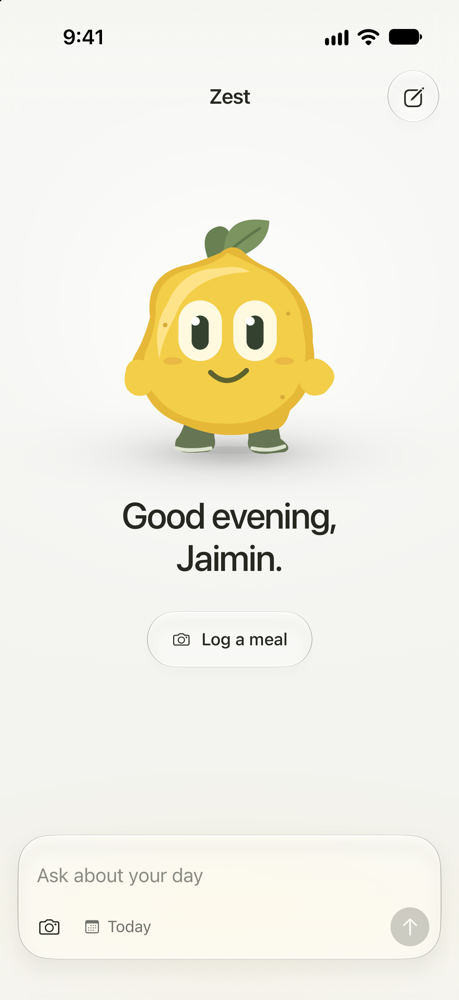
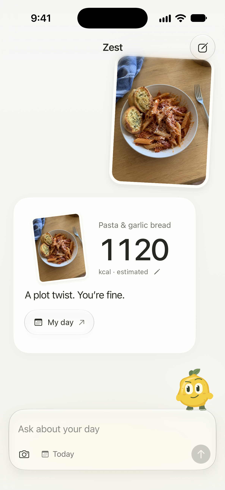
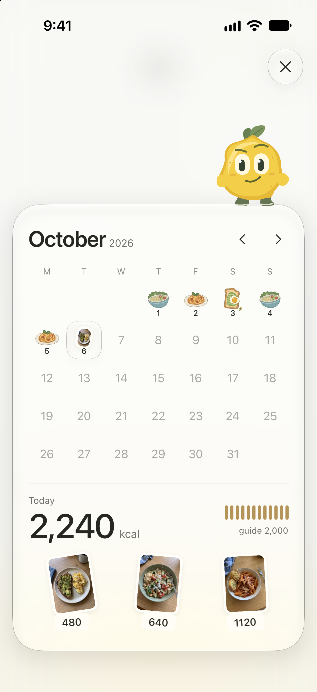

# Zest · Liquid Glass Food Tracker

A light-themed React Native + Expo cookbook. One lemon, a food diary made of stickers, and native glass that moves with the keyboard.

<p align="center">
  
  
  
</p>

[Watch the native walkthrough](docs/images/walkthrough.mp4) — a 23-second sample-meal, diary, and chat sequence captured at the simulator's original aspect ratio.

Zest opens directly into the tracker. There is no gallery, character picker, or back button. The lemon notices touches, perches on the composer during a conversation, and moves onto the diary as it opens. Short replies arrive as a photo, a number, and a few words.

## What is here

- Apple's native Liquid Glass via `expo-glass-effect`, with SwiftUI glass icon buttons through `@expo/ui`.
- A code-drawn Skia lemon with gaze, blinking, touch response, and gentle reactions to the logged total.
- Progressive blur at reading boundaries and a restrained warm accent beneath the composer.
- Native camera/library entry, plus an explicit sample-camera experience that needs no account or network.
- Four illustrated meal choices, a progressive receipt, large visual diary answers, and a sticker calendar.
- An editable local diary: meal names, calories, deletion, and a daily guide survive app termination.
- An independent feature folder, original local artwork, asset checksums, a locked dependency tree, and reproducible checks.

This is a UI template with deterministic local answers. It does not analyze food photographs or contact an AI service. Imported photos ask for a meal name and calorie amount; bundled sample meals use fixture estimates. Protein is available for sample meals only. Conversations reset on relaunch; diary entries persist. [Behavior and integration boundaries](docs/INTEGRATION.md).

## Run it

Use Node **22.13+**, macOS, Xcode with an iOS simulator, and CocoaPods. This is an iPhone-first native project; Expo Go is not the preview target.

```bash
npm ci
npm run ios:release
```

Choose a simulator when prompted, or target a specific device:

```bash
npx expo run:ios --configuration Release --device <simulator-udid>
```

For everyday development:

```bash
npm run ios
```

Native glass APIs require iOS 26+ and an SDK that provides them. The published previews were checked with **Xcode 27 / iOS 27 on iPhone 17 Pro**. An older runtime or SDK may render different glass even when the API is available. The deployment target is iOS 17; unsupported devices and Reduce Transparency receive an opaque, legible surface.

`enableSceneSupport: true` is intentional. Build against the current Apple SDK, keep glass outside opacity/mask ancestors and opaque container fills, and verify background response and touch expansion in the actual simulator. A successful build alone does not verify the material. [Native material and motion notes](docs/MOTION_SPEC.md).

### Try the sample diary

An ordinary first launch starts empty. “Log a meal” → “Try a sample meal” opens the bundled dinner viewfinder without requesting camera access. To reproduce the populated showcase:

```bash
xcrun simctl openurl <simulator-udid> 'zest-kcal-tracker://?demo=1'
```

**`demo=1` replaces this app's local diary with sample data.** It supplies ten days of history and breakfast/lunch today. Use an isolated simulator for demonstrations. A subsequent ordinary launch retains that diary; uninstall the sample app to return to a completely empty store.

## Architecture

The layout follows [Appllama's Liquid Glass Chat UI](https://github.com/Appllama/liquid-glass-chat-ui): thin Expo Router adapters and one independent cookbook that owns its UI, state, motion, and assets.

```text
assets/
  cookbooks/zest/photos/       Three original sample meal photographs
  cookbooks/zest/stickers/     Five authored food illustrations
  images/                     Original vector icon and its PNG export
src/
  app/                        Root route and native providers
  cookbooks/zest/
    screens/                  ZestScreen coordinates the feature
    components/               Composer, lemon, calendar, receipt, camera, editor
      ui/                     Native glass, SwiftUI buttons, gestures, symbols, blur
    data/                     Local dates, nutrition fixtures, answers, photo identity
    hooks/                    Shared scene and native keyboard geometry
    motion/                   Backdrop shader, easing, tilt response
    state/                    Portable diary store and native file adapter
    theme.ts                  Light palette
  index.ts                    Named public exports
packages/                     Expo Router URI-decoder compatibility adapter
plugins/                      Regenerable iOS build-path quoting fix
prompts/                      Integration brief and exact meal image prompts
docs/                         Motion, integration, provenance, verification, previews
scripts/                      Asset inventory, native tests and recording helper
tests/                        Dates, totals, persistence, decoder and repository checks
.github/workflows/ci.yml       Install, verify, iOS JavaScript export
```

The native `ios/` and `android/` folders are generated by Expo and excluded from source control. No environment variables, remote assets, API keys, or private source checkout are needed. `npm ci` installs everything inside this project; it does not use the original chat cookbook's `node_modules`.

## Reuse the screen

```tsx
import { ZestScreen } from './src';

<ZestScreen displayName="Alex" />
```

Keep the providers from `src/app/_layout.tsx`: Gesture Handler, Safe Area, and Keyboard Controller. The bundled route uses “Jaimin” as the sample name. Pass your own `displayName`, replace the sample meal data, and change the bundle ID/scheme in `app.json` for your app. [Integration guide](docs/INTEGRATION.md) and [build brief](prompts/integration.md).

The diary uses a Zustand store with an injected storage boundary. Its native adapter writes `Documents/zest-diary.json`; copied user photos stay in the app's Documents directory. The public `zestTheme` export describes the light palette. Changing it does not yet replace hard-coded illustration inks or shader colors; those are documented source customization points.

## Verify and record

```bash
npm run verify
npx expo-doctor
npx expo export --platform ios
SIMULATOR_UDID=<booted-device> npm run test:ios
```

The native checks require [Maestro](https://docs.maestro.dev). Run them on a dedicated simulator: the test clears this app's data and then seeds the explicit sample diary. CI validates JavaScript and repository integrity; native simulator verification is separate. Two unpatched transitive tooling advisories are recorded in [dependency notes](docs/DEPENDENCIES.md); the current npm audit is not clean.

```bash
SIMULATOR_UDID=<booted-device> scripts/record-ios.sh walkthrough
```

Stop recording with Control-C. Raw captures stay under ignored `.qa/recordings/`. Use the native simulator resolution; do not stretch the export. [Verified results and limits](docs/VERIFICATION.md).

## Contributing

Keep changes inside the Zest cookbook unless a provider or native dependency needs to change. Preserve photo identity through camera, receipt, and calendar; keep the glass material outside clipped or opacity-animated parents; check keyboard clearance and cancellation before changing timing. Run `npm run verify`, review the native flow, and update provenance/checksums when changing artwork:

```bash
node scripts/asset-manifest.mjs
```

Only runtime artwork, source, documentation previews, and reproducible tools belong here. Generated native projects, signing material, raw research/video, local agent files, and caches are ignored.

## License

Original code and authored artwork are available under [MIT](LICENSE). Dependencies retain their licenses. Generated meal photos and simulator previews are identified in [asset provenance](docs/ASSET_PROVENANCE.md); [NOTICE.md](NOTICE.md) explains the project and branding boundaries.

An open-source creation by [Appllama](https://appllama.io). Follow [Appllama](https://x.com/appllamaio) and [Jaimin](https://x.com/jaimintf).
